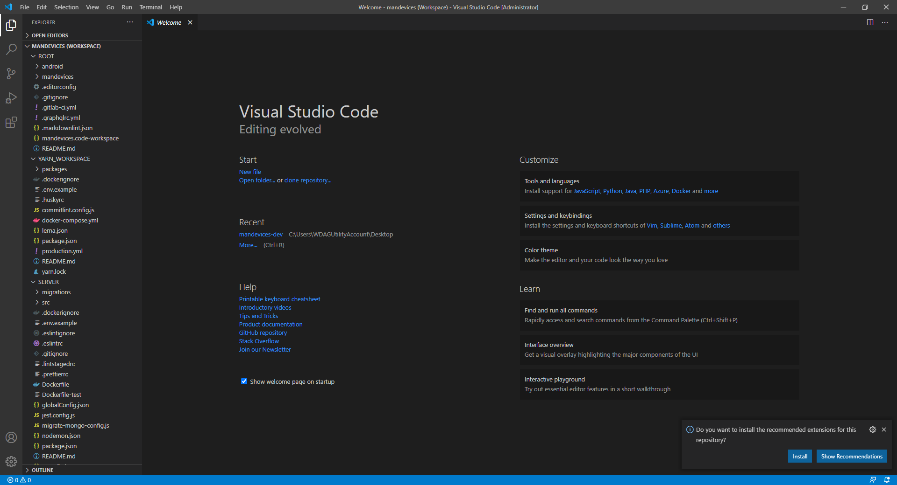
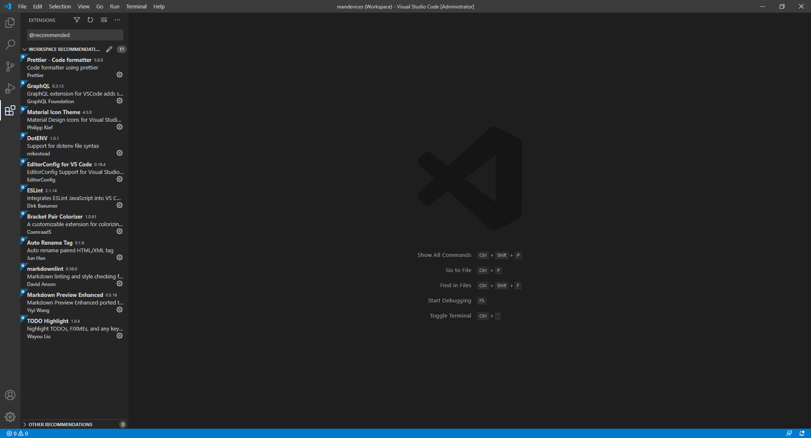
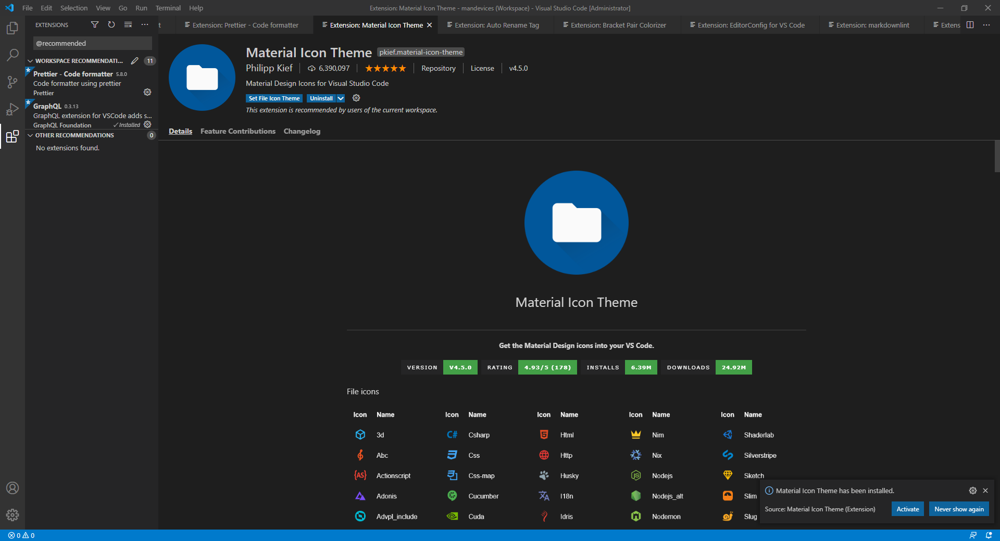
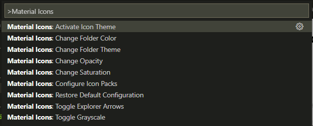

# Hệ thống phần mềm Quản lý Mandevices

## **Mục lục**

-   [1. Cấu trúc dự án](#cấu-trúc-dự-án)
-   [2. Cài đặt](#cài-đặt)
-   [3. Chạy dự án](#chạy-dự-án)
-   [4. Chạy kiểm thử](#chạy-kiểm-thử)
-   [5. Các biến môi trường phục vụ CI CD](#các-biến-môi-trường-phục-vụ-ci-cd)
-   [6. Style guide and Coding Convetions](#style-guide-and-coding-convetions)

## Cấu trúc dự án

**Thư mục:**

-   `.git/`
-   `android/`: Mã nguồn Android Native Client
-   `mandevices/`: Mã nguồn `server`, `webApp`, `websites` tổ chức theo `yarn workspace & lerna`
    -   `packages/`
        -   `server/`: Mã nguồn Server của dự án
        -   `webApp/`: Mã nguồn Web App Client (Sử dụng nội bộ)
        -   `websites`: Mã nguồn Websites Client (public)
-   `mandevices.code-workspace`: File cấu hình VS Code WorkSpace
-   `README.md`: Tài liệu hướng dẫn phát triển dự án

**Cấu trúc VS Code workspace mặc định:**

-   `ROOT`: Thư mục gốc của dự án
-   `YARN_WORKSPACE`: Thư mục gốc `yarn workspace` của `server`, `client`
-   `SERVER`: Mã nguồn `server`
-   `WEB_APP`: Mã nguồn `webApp`
-   `WEBSITES`: Mã nguồn `websites`

**[⬆ Về đầu trang](#mục-lục)**

## Cài đặt

-   **NodeJS**

-   **Yarn**

-   **MongoDB**

-   **VSCode IDE**

    -   **_Cài đặt IDE_**

    -   **_Cài đặt Extensions_**

        **Các Extensions cần cài đặt:**

        -   `esbenp.prettier-vscode`
        -   `graphql.vscode-graphql`
        -   `pkief.material-icon-theme`
        -   `mikestead.dotenv`
        -   `editorconfig.editorconfig`
        -   `dbaeumer.vscode-eslint`
        -   `coenraads.bracket-pair-colorizer`
        -   `formulahendry.auto-rename-tag`
        -   `davidanson.vscode-markdownlint`
        -   `shd101wyy.markdown-preview-enhanced`
        -   `wayou.vscode-todo-highlight`

        **Hướng dẫn cài đặt Extensions:**

        -   **_Mở file `mandevices.code-workspace` bằng `VSCode`_**
        -   **_Hộp thoại sẽ xuất hiện ở góc dưới bên phải như hình_**
            

            Chọn `Install` để cài đặt toàn bộ `Extensions`

        -   **_Nếu hộp thoại không xuất hiện, có thể chuyển sang cách cài đặt thủ công như sau:_**

            -   Mở tab `Extensions` (**Ctrl + Shift + X**)
            -   Gõ `@recommended` vào ô tìm kiếm, sẽ xuất hiện các `Extensions` cần cài đặt
                
            -   Cài đặt từng `Extension`

        **Lưu ý khi cài Extension `pkief.material-icon-theme`:**

        -   Cần phải kích hoạt Theme bằng việc click vào `Active` ở hộp thoại như hình
            
        -   Nếu hộp thoại không xuất hiện, có thể kích hoạt bằng cách dùng lệnh như sau:
            -   Gõ phím `F1` để mở hộp thoại nhập lệnh của `VSCode`
            -   Lưu ý phải có dấu nhắc lệnh `>` ở ô nhập
            -   Gõ **Material Icons**, rồi chọn lệnh `Material Icons: Activate Icon Theme`
                

-   **Thư viện phụ thuộc**

    -   Mở `terminal` tại đường dẫn đến `YARN_WORKSPACE`
    -   Gõ lệnh: `yarn`

-   **Biến môi trường**

    -   Ứng với mỗi file `.env.example`, tạo file `.env` mới
    -   Các `KEY` trong file `.env` sẽ dựa trên `KEY` trong file `.env.example`
    -   Ý nghĩa các `KEY` được trình bày ở phía dưới

        -   **_Server_**

            -   Vị trí file `.env.example`: `mandevices/packages/server/.env.example`

            -   Ý nghĩa các biến

                -   `NODE_ENV`: Môi trường phát triển
                    -   `bắt buộc`
                    -   Giá trị có thể cài đặt: `development`, `test`, `production`
                -   `PORT`: Cổng mà `server` lắng nghe
                    -   `tùy chọn`
                    -   Giá trị mặc định: `3001`
                    -   Giá trị có thể cài đặt: số
                -   `DB_URI`: Đường dẫn đến MongoDB Database

                    -   `tùy chọn`
                    -   Giá trị: **`mongodb://`<tên miền|địa chỉ IP>:<cổng>/<tên db>**

                        -   Thay `<tên miền|địa chỉ IP>`, `<cổng>`, `<tên db`> bằng giá trị thực tế
                        -   Nếu db không tồn tại, hệ thống sẽ tự khởi tạo để sử dụng

                    -   Mặc định: **`mongodb://localhost:27017/mandevices-default`**

                -   `GOOGLE_CLIENT_ID`
                -   `GOOGLE_CLIENT_ID_WEB`

            -   Lưu ý:
                -   Đường dẫn đến Server GraphQL
                    -   `http://localhost:<PORT>/graphql`
                    -   `http://127.0.0.1:<PORT>/graphql`
                -   Đường dẫn đến Server GraphQL Subscription
                    -   `ws://localhost:<PORT>/subscription`
                    -   `ws://127.0.0.1:<PORT>/subscription`

        -   **_WebApp_**

            -   Vị trí file `.env.example`: `mandevices/packages/webApp/.env.example`

            -   Ý nghĩa các biến

                -   `NODE_ENV`: Môi trường phát triển

                    -   `bắt buộc`
                    -   Giá trị có thể cài đặt: `development`, `test`, `production`

                -   `PORT`: Cổng mà `web` lắng nghe
                    -   `tùy chọn`
                    -   Giá trị mặc định: `3000`
                    -   Giá trị có thể cài đặt: số
                -   `REACT_APP_GRAPHQL_URI`: Đường dẫn đến Server GraphQL
                    -   `bắt buộc`
                -   `REACT_APP_GRAPHQL_WEBSOCKET`: Đường dẫn đến Server GraphQL Subscription

                    -   `bắt buộc`

                -   `VERBOSE`

**[⬆ Về đầu trang](#mục-lục)**

## Chạy dự án

-   Chạy cả `server`, `webApp`, `websites`
    -   Mở `terminal` tại đường dẫn `YARN_WORKSPACE`
    -   Gõ lệnh `yarn dev`
-   Chạy `server`
    -   Mở `terminal` tại đường dẫn thư mục gốc mã nguồn `server`
    -   Gõ lệnh `yarn dev`
-   Chạy `webApp`
    -   Mở `terminal` tại đường dẫn thư mục gốc mã nguồn `webApp`
    -   Gõ lệnh `yarn dev`
-   Chạy `websites`
    -   Mở `terminal` tại đường dẫn thư mục gốc mã nguồn `websites`
    -   Gõ lệnh `yarn dev`

## Chạy kiểm thử

-   **Server**
    -   Mở `terminal` tại thư mục gốc mã nguồn server
    -   Gõ lệnh `yarn test`
-   **WebApp**
    -   Chạy `server`
    -   Mở `terminal` tại thư mục gốc mã nguồn web app
    -   Gõ lệnh `yarn test`
-   **Websites**
    -   Chạy `server`
    -   Mở `terminal` tại thư mục gốc mã nguồn websites
    -   Gõ lệnh `yarn test`

**[⬆ Về đầu trang](#mục-lục)**

## Các biến môi trường phục vụ CI-CD

-   `SERVER_PORT`: Cổng mà `server` lắng nghe trong `container`
-   `WEB_APP_PORT`: Cổng mà `webApp` lắng nghe trên VPS
-   `WEBSITES_PORT`: Cổng mà `websites` lắng nghe trên VPS
-   `GOOGLE_CLIENT_ID`: server
-   `REACT_APP_GOOGLE_CLIENT_ID`: web
-   `SSH_USER`: user vps
-   `VPS`: domain/ip vps
-   `PATH_TO_PROJECT`: Đường dẫn đến thư mục `deploy`

**[⬆ Về đầu trang](#mục-lục)**

## Style guide and Coding Convetions

### Key Sections

-   [Variable](#variable-and-function)
-   [Class](#class)
-   [Interface](#interface)
-   [Type](#type)
-   [Namespace](#namespace)
-   [Enum](#enum)
-   [`null` vs. `undefined`](#null-vs-undefined)
-   [Single vs. Double Quotes](#quotes)
-   [Tabs vs. Spaces](#spaces)
-   [Use semicolons](#semicolons)
-   [Annotate Arrays as `Type[]`](#array)
-   [File Names](#filename)
-   [`type` vs `interface`](#type-vs-interface)

**[⬆ Về đầu trang](#mục-lục)**

## Variable and Function

-   Use `camelCase` for variable and function names

> Reason: Conventional JavaScript

**Bad:**

```ts
var FooVar;
function BarFunc() {}
```

**Good:**

```ts
var fooVar;
function barFunc() {}
```

**[⬆ Về đầu mục](#key-sections)**

## Class

-   Use `PascalCase` for class names.

> Reason: This is actually fairly conventional in standard JavaScript.

**Bad:**

```ts
class foo {}
```

**Good:**

```ts
class Foo {}
```

-   Use `camelCase` of class members and methods

> Reason: Naturally follows from variable and function naming convention.

**Bad:**

```ts
class Foo {
	Bar: number;
	Baz() {}
}
```

**Good:**

```ts
class Foo {
	bar: number;
	baz() {}
}
```

**[⬆ Về đầu mục](#key-sections)**

## Interface

-   Use `PascalCase` for name.

> Reason: Similar to class

-   Use `camelCase` for members.

> Reason: Similar to class

-   **Don't** prefix with `I`

> Reason: Unconventional. `lib.d.ts` defines important interfaces without an `I` (e.g. Window, Document etc).

**Bad:**

```ts
interface IFoo {}
```

**Good:**

```ts
interface Foo {}
```

**[⬆ Về đầu mục](#key-sections)**

## Type

-   Use `PascalCase` for name.

> Reason: Similar to class

-   Use `camelCase` for members.

> Reason: Similar to class

**[⬆ Về đầu mục](#key-sections)**

## Namespace

-   Use `PascalCase` for names

> Reason:
>
> -   Convention followed by the TypeScript team. Namespaces are effectively just a class with static members.
> -   Class names are `PascalCase` => Namespace names are `PascalCase`

**Bad:**

```ts
namespace foo {}
```

**Good:**

```ts
namespace Foo {}
```

**[⬆ Về đầu mục](#key-sections)**

## Enum

-   Use `PascalCase` for enum names

> Reason: Similar to Class. Is a Type.

**Bad:**

```ts
enum color {}
```

**Good:**

```ts
enum Color {}
```

-   Use `PascalCase` for enum member

> Reason:
>
> -   Convention followed by TypeScript team i.e. the language creators e.g `SyntaxKind.StringLiteral`.
> -   Also helps with translation (code generation) of other languages into TypeScript.

**Bad:**

```ts
enum Color {
	red,
}
```

**Good:**

```ts
enum Color {
	Red,
}
```

**[⬆ Về đầu mục](#key-sections)**

## Null vs. Undefined

-   Prefer not to use either for explicit unavailability

> Reason:
>
> -   these values are commonly used to keep a consistent structure between values.
> -   In TypeScript you use _types_ to denote the structure

**Bad:**

```ts
let foo = { x: 123, y: undefined };
```

**Good:**

```ts
let foo: { x: number; y?: number } = { x: 123 };
```

-   Use `undefined` in general (do consider returning an object like `{valid:boolean, value?:Foo}` instead)

**Bad:**

```ts
return null;
```

**Good:**

```ts
return undefined;
```

-   Use `null` where it's a part of the API or conventional

> Reason: It is conventional in Node.js e.g. `error` is `null` for NodeBack style callbacks.

**Bad:**

```ts
cb(undefined);
```

**Good:**

```ts
cb(null);
```

-   Use _truthy_ check for **objects** being `null` or `undefined`

**Bad:**

```ts
if (error === null)
```

**Good:**

```ts
if (error)
```

-   Use `== null` / `!= null` (not `===` / `!==`) to check for `null` / `undefined` on primitives as it works for both `null`/`undefined` but not other falsy values (like `''`, `0`, `false`) e.g.

**Bad:**

```ts
if (error !== null) // does not rule out undefined
```

**Good:**

```ts
if (error != null) // rules out both null and undefined
```

**[⬆ Về đầu mục](#key-sections)**

## Quotes

-   Prefer single quotes (`'`) unless escaping.

> Reason:
>
> -   More JavaScript teams do this (e.g. [airbnb](https://github.com/airbnb/javascript), [standard](https://github.com/feross/standard), [npm](https://github.com/npm/npm), [node](https://github.com/nodejs/node), [google/angular](https://github.com/angular/angular/), [facebook/react](https://github.com/facebook/react)).
> -   It's easier to type (no shift needed on most keyboards). [Prettier team recommends single quotes as well](https://github.com/prettier/prettier/issues/1105)

-   When you can't use double quotes, try using back ticks (\`).

> Reason: These generally represent the intent of complex enough strings.

**[⬆ Về đầu mục](#key-sections)**

## Spaces

-   Use `2` spaces. Not tabs.
    <!-- markdownlint-disable-next-line -->
    > Reason: More JavaScript teams do this (e.g. [airbnb](https://github.com/airbnb/javascript), [idiomatic](https://github.com/rwaldron/idiomatic.js), [standard](https://github.com/feross/standard), [npm](https://github.com/npm/npm), [node](https://github.com/nodejs/node), [google/angular](https://github.com/angular/angular/), [facebook/react](https://github.com/facebook/react)). The TypeScript/VSCode teams use 4 spaces but are definitely the exception in the ecosystem.

**[⬆ Về đầu mục](#key-sections)**

## Semicolons

-   Use semicolons.
    <!-- markdownlint-disable-next-line -->
    > Reasons: Explicit semicolons helps language formatting tools give consistent results.Example teams: [airbnb](https://github.com/airbnb/javascript), [idiomatic](https://github.com/rwaldron/idiomatic.js), [google/angular](https://github.com/angular/angular/), [facebook/react](https://github.com/facebook/react), [Microsoft/TypeScript](https://github.com/Microsoft/TypeScript/).

**[⬆ Về đầu mục](#key-sections)**

## Array

-   Annotate arrays as `foos: Foo[]` instead of `foos: Array<Foo>`.
    <!-- markdownlint-disable-next-line -->
    > Reasons: It's easier to read. It's used by the TypeScript team. Makes easier to know something is an array as the mind is trained to detect `[]`.

**[⬆ Về đầu mục](#key-sections)**

## Filename

Name files with `camelCase`. E.g. `accordion.tsx`, `myControl.tsx`, `utils.ts`, `map.ts` etc.

> Reason: Conventional across many JS teams.

**[⬆ Về đầu mục](#key-sections)**

## type vs. interface

-   Use `type` when you _might_ need a union or intersection:

```ts
type Foo = number | { someProperty: number };
```

-   Use `interface` when you want `extends` or `implements` e.g.

```ts
interface Foo {
	foo: string;
}
interface FooBar extends Foo {
	bar: string;
}
class X implements FooBar {
	foo: string;
	bar: string;
}
```

**[⬆ Về đầu mục](#key-sections)**
**[⬆ Về đầu trang](#mục-lục)**
